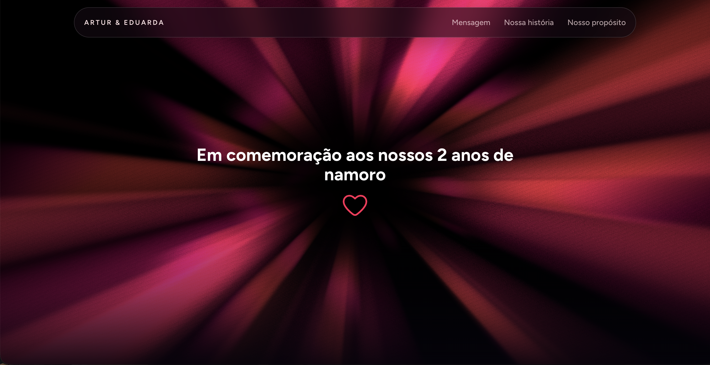
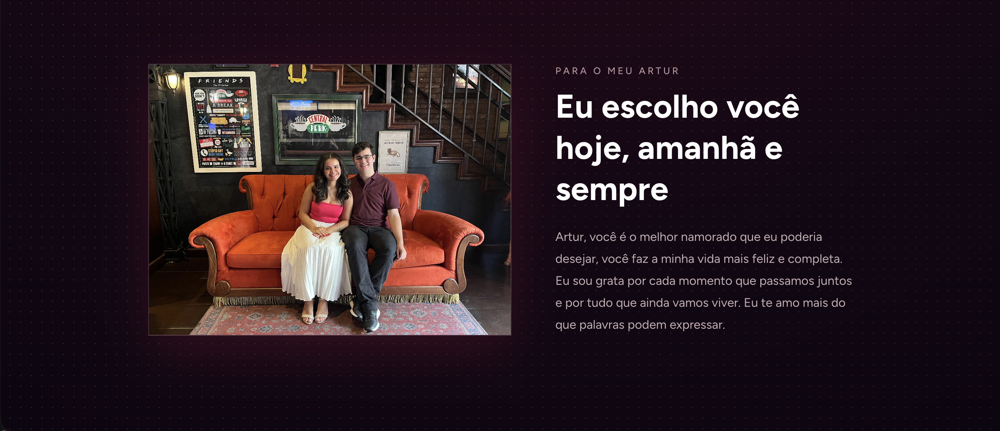
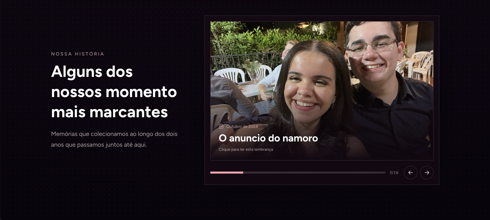
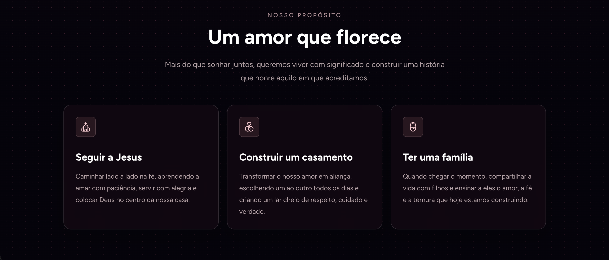
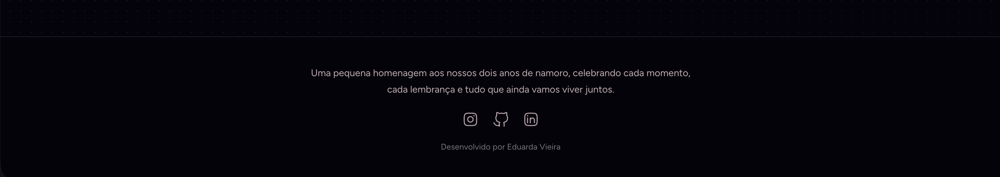

# 2 anos de namoro | Eduarda e Artur

<!-- Coloque uma imagem do projeto completo em public/project-preview.png -->






Uma homenagem interativa aos nossos dois anos de namoro, criada para celebrar nossa história, nossas memórias e os sonhos que ainda vamos construir juntos.

## Sobre o projeto

Este projeto é uma página comemorativa com uma experiência visual romântica e interativa. A página reúne:

- Mensagem inicial com efeito visual e coração interativo.
- Foto e mensagem dedicada ao Artur.
- Linha do tempo com carrossel de fotos e modal para cada lembrança.
- Seção de propósito com planos e valores para o futuro.
- Header com efeito glass e navegação por seções.
- Footer com redes sociais e informações sobre a homenagem.

## Tecnologias

- [Next.js](https://nextjs.org/) com App Router.
- [React](https://react.dev/).
- [TypeScript](https://www.typescriptlang.org/).
- [Tailwind CSS](https://tailwindcss.com/).
- [React Bits](https://reactbits.dev/) para componentes e efeitos visuais, incluindo o campo de bolinhas.
- [shadcn/ui](https://ui.shadcn.com/) e `tw-animate-css` para a base de estilos e utilitários.
- [OGL](https://github.com/oframe/ogl) para o efeito prismático em WebGL.
- [Hugeicons](https://hugeicons.com/) para os ícones da interface.

## Como executar

### Pré-requisitos

- Node.js 20 ou superior.
- npm.

### Instalação

```bash
npm install
```

### Ambiente de desenvolvimento

```bash
npm run dev
```

Abra [http://localhost:3000](http://localhost:3000) no navegador.

### Build de produção

```bash
npm run build
npm run start
```

## Estrutura principal

```text
src/
├── app/
│   ├── globals.css
│   ├── layout.tsx
│   └── page.tsx
├── components/
│   ├── AnimatedHeart.tsx
│   ├── DotField.tsx
│   ├── Footer.tsx
│   ├── Header.tsx
│   ├── PrismaticBurst.tsx
│   ├── PurposeSection.tsx
│   ├── SplitText.tsx
│   └── StorySection.tsx
└── lib/
	└── utils.ts
```

As fotos da história ficam em `public/nos-dois/` e são referenciadas diretamente pelas páginas com caminhos como `/nos-dois/pedido.jpg`.

## Personalização

Para trocar a imagem de preview do README, adicione o arquivo:

```text
public/project-preview.png
```

Para adicionar ou alterar lembranças, edite a lista `stories` em `src/components/StorySection.tsx` e coloque as novas imagens na pasta `public/nos-dois/`.

## Sobre mim

Sou **Eduarda Vieira**, desenvolvedora apaixonada por criar experiências digitais com intenção, cuidado e personalidade. Este projeto foi feito como uma homenagem especial aos meus dois anos de namoro com o Artur.

### Minhas redes

- [Instagram](https://www.instagram.com/eduardavieira)
- [GitHub](https://github.com/eduardavieira)
- [LinkedIn](https://www.linkedin.com/in/eduardavieira)

---

Feito com carinho por **Eduarda Vieira**.
